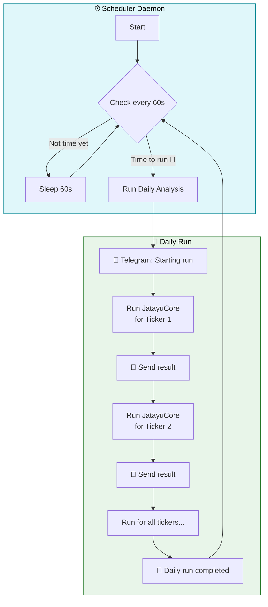
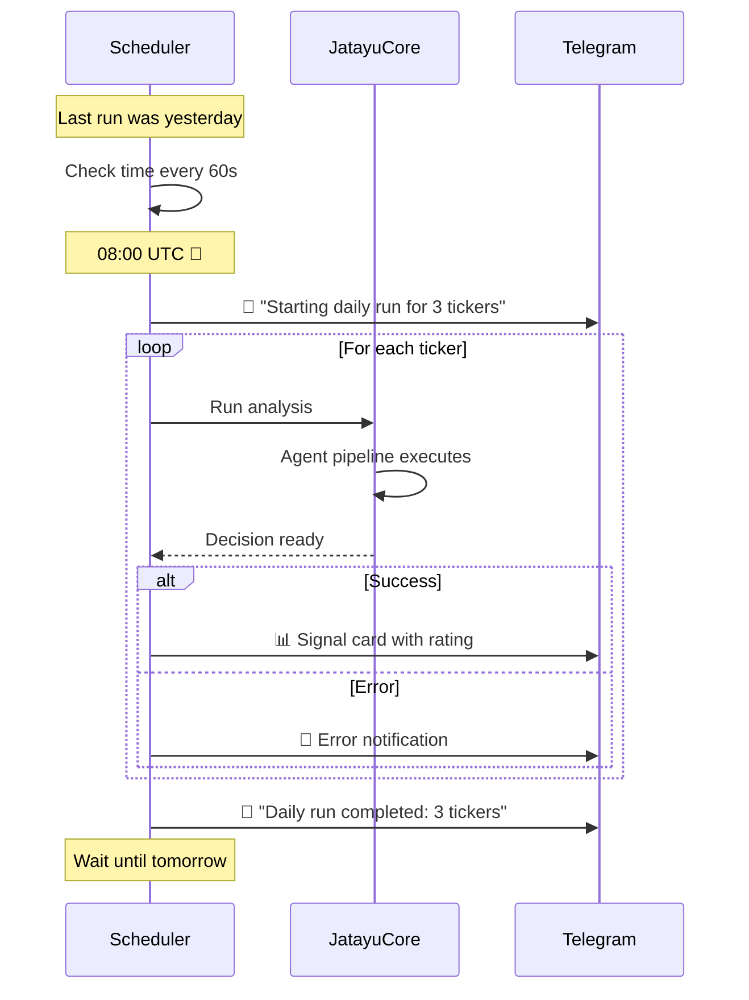

# Scheduler

The `TradingScheduler` runs automated daily trading sessions so you don't have to manually trigger analyses.

## How It Works



## Usage

```bash
# Run scheduler every 3 hours (default)
python main.py schedule

# Custom tickers and interval
python main.py schedule --tickers AAPL,MSFT,GOOGL --interval 2

# Run as background daemon (Unix only)
python main.py schedule -D --tickers AAPL,NVDA,MSFT --interval 3

# With Docker
docker compose up -d jatayucore
```

## Features

### Interval Mode
Default tiap **3 jam** (bisa diubah pake `--interval`). Skip otomatis kalo Sabtu/Minggu.

### Circuit Breaker
Kalo **Stop Loss kena 2 kali dalam sehari**, bot berhenti trading otomatis — kirim notif ke Telegram "⛔ TRADING HALTED". Reset otomatis besoknya.

### Daemon Mode
`-D` flag fork proses ke background. Cocok buat di VPS atau systemd.

### Background Monitor
Bersamaan scheduler jalan, **PositionMonitor** aktif di thread terpisah:
| Monitor | Interval | Fungsi |
|---------|----------|--------|
| Stop Loss | 60 detik | Cek harga, auto close kalo turun 5% |
| Circuit Breaker | bareng SL | Stop trading kalo SL kena 2× |
| Position Summary | 1 jam | Kirim P&L tiap posisi ke Telegram |
| Heartbeat | 2 jam | Kirim "masih hidup" + equity |
| Daily P&L | 1x/hari | Rekap portfolio |

## Command Options

| Option | Default | Description |
|--------|---------|-------------|
| `--tickers`, `-t` | `NVDA,AAPL,SPY` | Comma-separated stock symbols |
| `--interval` | `3` | Hours between runs |
| `--daemon`, `-D` | `false` | Fork ke background |

## What Happens Each Run



## Telegram Notifications

The scheduler sends these notifications:

| Event | Icon | Example |
|-------|------|---------|
| **Startup** | 💚 | `Scheduler started` |
| **Daily Start** | 📊 | `Starting daily run for 3 tickers` |
| **Each Result** | 🟢/🔴 | Full analysis signal card |
| **On Error** | 🚨 | Error details with ticker |
| **Completion** | ✅ | `Daily run completed: 3 tickers` |
| **Shutdown** | 💚 | `Scheduler stopped` |

## Non-Technical Summary

Think of the scheduler as your personal trading assistant that:

1. **Wakes up** at a specific time every day (e.g., 8:00 AM)
2. **Checks your watchlist** — all the stocks you want to monitor
3. **Runs the analysis** — the AI team analyzes each stock
4. **Sends you a report** — you get a Telegram message for each result
5. **Goes back to sleep** — waits until the next day

You can configure which stocks to watch and what time to run — no coding required.
